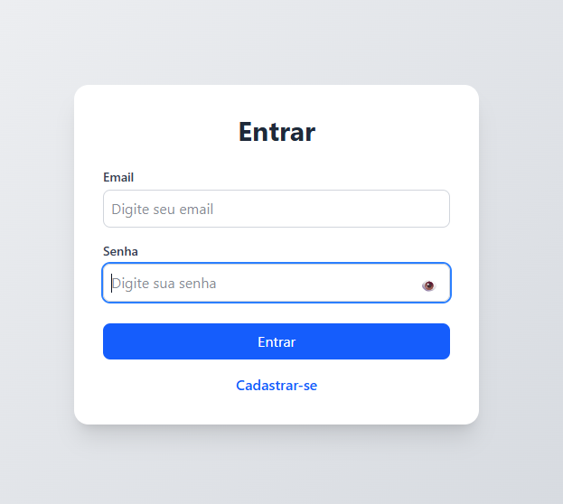
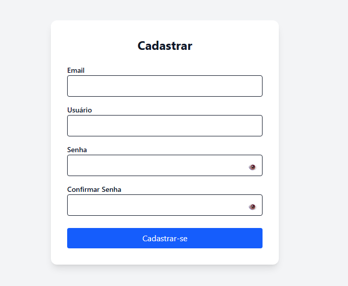
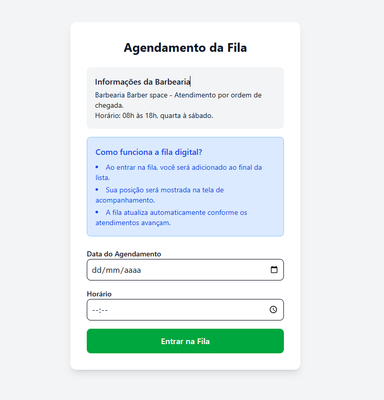
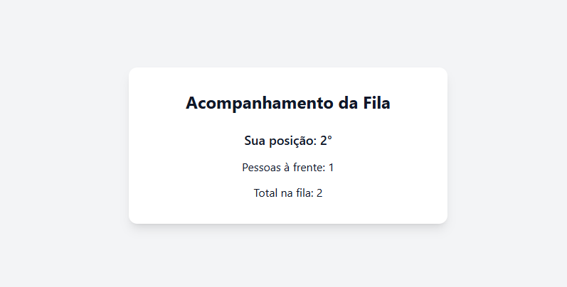
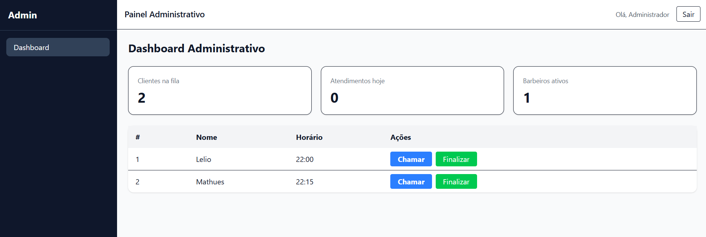
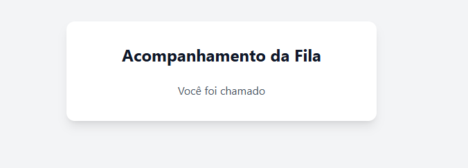

# 💈 Sistema de Fila para Barbearias

## 📌 Sobre o projeto

Este projeto é uma aplicação web full stack desenvolvida para gerenciar filas de espera em barbearias, com o objetivo de organizar o atendimento e melhorar a experiência dos clientes e dos profissionais.

O sistema permite que clientes entrem na fila e que o barbeiro tenha controle completo sobre a ordem de atendimento.

---

## 🚀 Tecnologias utilizadas

### Front-end
- React
- Next.js
- Tailwind CSS

### Back-end
- Python
- FastAPI

### Banco de dados
- MongoDB (NoSQL)

---

## ⚙️ Funcionalidades

- Cadastro de clientes
- Entrada e gerenciamento da fila
- Controle de atendimento (próximo cliente)
- Interface responsiva e moderna
- Integração entre front-end e back-end

---

## 🧠 Aprendizados

Durante o desenvolvimento deste projeto, foram aplicados conceitos como:

- Desenvolvimento full stack
- Criação de APIs REST com FastAPI
- Integração entre front-end e back-end
- Modelagem de banco de dados NoSQL com MongoDB
- Organização de arquitetura de software

---

## 🏗️ Estrutura do projeto

O back-end da aplicação foi estruturado seguindo boas práticas de organização e separação de responsabilidades, inspirado no padrão MVC (Model-View-Controller) e utilizando uma camada de serviços.

### Estrutura:

- **models**: definição das entidades e estrutura de dados  
- **schemas**: validação e tipagem dos dados com Pydantic  
- **routes**: definição das rotas da API  
- **services**: implementação das regras de negócio  
- **db**: configuração e conexão com o banco de dados  
- **utils**: funções auxiliares reutilizáveis  

### 🔐 Tela de Login
 

### 📝 Cadastro

### 📅 Agendamento

### 📊 Fila

### ⚙️ Painel Admin

### 📣 Cliente Chamado

